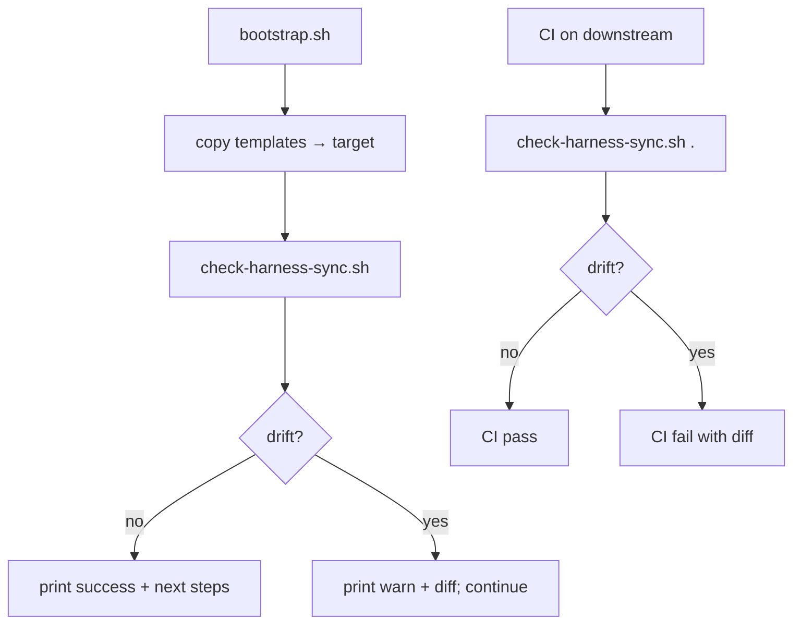

# Change: Harness sync check (issue #3)

## Intent

Closes https://github.com/PermissionLabs/forgekit/issues/3.

The `wildfolio-server` incident (2026-05-20) had a downstream repo whose
`AGENTS.md`, `CLAUDE.md`, and `docs/AGENT_GUIDE.md` were created from an
abridged set of harness content that did not match `templates/`. The agent
followed those files faithfully — and missed the workflow rules that lived
only in the upstream templates.

Add a verifier that catches this drift before it becomes an incident:

- `scripts/check-harness-sync.sh` compares every harness-owned file in a
  target repo against `templates/` and fails with a diff on drift.
- `scripts/bootstrap.sh` calls it automatically after copy so a fresh
  bootstrap is verified before the user sees the success message.
- `docs/BOOTSTRAP.md` documents how to wire the check into the target's CI
  so future drift fails the build instead of being noticed late.

## Scope

- In scope: new `scripts/check-harness-sync.sh`; bootstrap.sh integration;
  BOOTSTRAP.md doc additions (post-bootstrap checklist, CI snippet,
  `forgekit-override` escape hatch).
- Out of scope: an actual GitHub Actions workflow in this repo (forgekit
  itself does not need CI for sync; downstream does). A pre-push hook
  template (filed previously as a follow-up to issue #5).

## Current State

Before this change:

- `scripts/bootstrap.sh` had an inline `diff_lines` check that compared
  `AGENTS.md` to `CLAUDE.md` for the title-only diff, but it did not verify
  the target against `templates/` at all. It also silently exited 1 under
  `set -euo pipefail` because the `diff | wc -l | tr -d` pipeline failed
  pipefail when the files legitimately differed — a real bug surfaced while
  writing this change.
- `docs/BOOTSTRAP.md` had no concept of post-bootstrap sync verification or
  intentional deviation.
- No mechanism existed to catch root↔templates drift inside forgekit itself
  (a residual filed against PRs #6 and #8).

## Plan

- [x] Plan
- [x] Implement
- [ ] Review
- [ ] Human QA
- [ ] Merge
- [ ] Post-merge
- [ ] Compound capture

## Tracks

| Track | Status | Changed paths | Verification | Risks |
| --- | --- | --- | --- | --- |
| Tooling | In progress | scripts/check-harness-sync.sh, scripts/bootstrap.sh | local end-to-end smoke (fresh bootstrap → sync ok → induce drift → fail → add override → skip) | bash-only script; users on environments without bash will need to invoke explicitly |
| Docs | In progress | docs/BOOTSTRAP.md, docs/changes/issue-3-harness-sync-check.md | manual diff | none |
| Server / Deploy / Frontend / App / Shared contracts | Skipped | — | — | docs/tooling only |

## Architecture and Flow



## Implementation Notes

- **What gets checked.** Entrypoints (AGENTS.md, CLAUDE.md) allow only the
  title line to differ — that's the legitimate Codex/Claude split.
  Everything else is byte-identical: `docs/AGENT_GUIDE.md`,
  `docs/WORKFLOW.md`, every file under `docs/design-skills/` and
  `docs/review-skills/`, and the three template files
  (`CHANGE_TEMPLATE.md`, `DECISION_TEMPLATE.md`, `REVIEW_TEMPLATE.md`).
- **What is intentionally NOT checked.** `docs/PROJECT_CONTEXT.md`,
  `docs/HARNESS_NOTES.md`, and the contents of `docs/changes/`,
  `docs/decisions/`, `docs/audits/`, `docs/solutions/` — these are
  downstream-owned by design.
- **Escape hatch.** Files containing `forgekit-override:` in their first
  five lines are skipped with a `skip:` note. Documented in BOOTSTRAP.md
  with an example and a "use sparingly" warning.
- **Internal mode.** `--forgekit` flag checks the forgekit repo's own root
  entrypoints against `templates/` (title-line diff allowed). Closes the
  root↔templates drift gap raised in PRs #6 and #8 reviews. AGENT_GUIDE and
  WORKFLOW intentionally differ in framing between root and template, so
  they are excluded from the internal check.
- **Pre-existing bootstrap bug.** The old inline title-line check failed
  silently under `set -euo pipefail`. Removed it; the new sync script
  covers the same case correctly.
- **bash dependency.** Script requires bash (process substitution in
  `diff_ignore_title`). The shebang is `#!/usr/bin/env bash`. Acceptable
  given the existing scripts already require bash.

### Interaction with sibling issues

- **#5 (merged):** the hard gate entrypoint text is now part of the
  byte-identical baseline. A downstream that bootstrapped pre-#5 will fail
  the sync check until they re-bootstrap.
- **#4 (merged):** review-skills/ files are part of the baseline.
- **PR #6 / #8 review follow-up:** root↔templates internal check is now
  covered by the `--forgekit` mode.

## Documentation Updates

- Updated docs: `scripts/bootstrap.sh`, `scripts/check-harness-sync.sh`
  (new), `docs/BOOTSTRAP.md`, `docs/changes/issue-3-harness-sync-check.md`
  (new).
- BOOTSTRAP.md changes: post-bootstrap checklist gains a sync-check line,
  a new "Intentional deviation (forgekit-override)" section, and a CI
  example in "Repo-level enforcement".

## Verification

- Manual end-to-end test:
  ```bash
  tmp=$(mktemp -d)
  scripts/bootstrap.sh "$tmp"            # bootstrap + auto sync → ok
  scripts/check-harness-sync.sh "$tmp"   # rerun → ok
  echo tampered >> "$tmp/docs/AGENT_GUIDE.md"
  scripts/check-harness-sync.sh "$tmp"   # → DRIFT + diff, exit 1
  cat > "$tmp/docs/AGENT_GUIDE.md" <<EOF
  # Agent Guide
  <!-- forgekit-override: testing -->
  EOF
  scripts/check-harness-sync.sh "$tmp"   # → skip: docs/AGENT_GUIDE.md, exit 0
  ```
  All three states behave as expected.
- `scripts/check-harness-sync.sh --forgekit` → ok for root↔templates.
- Not run: no unit tests cover shell scripts; manual smoke is the
  appropriate verification.

## Review Cycles

| Cycle | Type | Findings | Resolution |
| --- | --- | --- | --- |
| 1 | Code + security | TBD | TBD |

## Human QA

- Handoff URL/build/instructions: PR will be opened; reviewer reads the
  diff and optionally runs the manual smoke above on their machine.
- Human-reported issues: TBD
- Fixes applied: TBD
- Accepted by human: TBD

## Branch & Merge Evidence

Known at implement time:

- Working branch: `feature/issue-3-harness-sync-check`
- Target branch: `main`
- PR URL: TBD

Required before marking `merge` / `post_merge` complete:

- Human review accepted by: TBD
- Human QA accepted by: TBD
- Merge SHA (or merged PR link): TBD
- Post-merge sync command + result: TBD
- Residual risks acknowledged: TBD

## Residuals

| Source | Finding | Disposition | Link/reason |
| --- | --- | --- | --- |
| Implementation | Existing downstream (`wildfolio-server`) will fail the new check until it re-bootstraps | accepted_with_reason | Catching that exact drift is the point of this change |
| Implementation | Pre-existing bootstrap.sh diff_lines bug under set -e/pipefail | fixed | Removed; check-harness-sync.sh covers the case |
| Plan | bash-only script | accepted_with_reason | Matches existing scripts/ convention; alternative would be a Python port |

## Compound Capture

- Reusable learning captured: yes — "harness contracts need machine-checked
  drift verification, not just prose"; the forgekit-override escape hatch
  is a portable pattern for any opt-out-with-reason mechanism.
- Solution doc: this CHANGE record + the new BOOTSTRAP.md "Intentional
  deviation" section together capture the lesson.
- Skipped because: n/a

## Follow-ups

- Consider porting the sync check to a language-agnostic implementation
  (Python or Go) if downstream environments without bash become common.
- Consider adding a pre-push hook template (filed under issue #5
  follow-up) — the sync check could be a candidate.
- After this lands, post to downstream maintainers that they should
  re-bootstrap or accept failing CI until they update.
