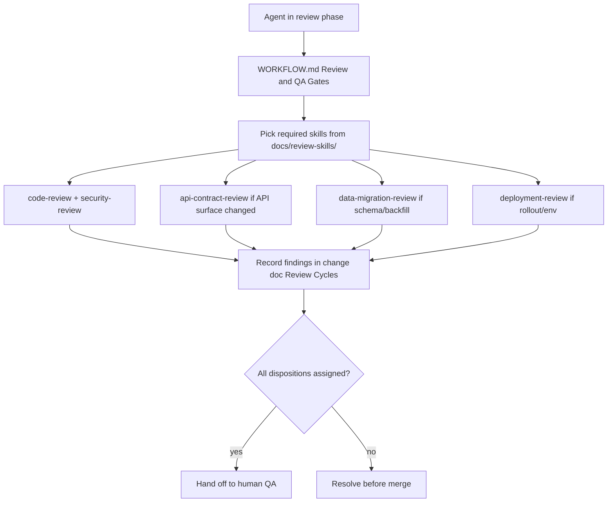

# Change: Define review skill checklists (issue #4)

## Intent

Closes https://github.com/PermissionLabs/forgekit/issues/4.

`docs/WORKFLOW.md` "Review and QA Gates" named the review *types* (code,
security, API contract, data migration, deployment) but never said *what to
check* or *which tool runs them*. Downstream agents picked tools by guess,
breaking the consistency the harness exists to enforce.

Add a `docs/review-skills/` directory whose files are the contract: each
review type has its own checklist, output shape, and disposition rules. Hosts
choose how to invoke (subagent, slash command, prompt) — ForgeKit owns the
checklist, not the invocation.

## Scope

- In scope: `templates/docs/review-skills/` with README + 5 review skill
  files; mirror to `docs/review-skills/` for forgekit's own use; WORKFLOW.md
  "Review and QA Gates" rewrite; AGENT_GUIDE.md doc map; BOOTSTRAP.md manual
  copy table.
- Out of scope: host-specific slash commands or subagent wrappers (left as
  optional examples in the README, not enforced).

## Current State

Before this change:

- `docs/WORKFLOW.md` §"Review and QA Gates" said *run code review and security
  review* but did not point at any concrete checklist or tool.
- No `docs/review-skills/` directory existed.
- Downstream incident (`wildfolio-server` track B recovery, 2026-05-20) had
  the agent self-decide review tool selection.

## Plan

- [x] Plan
- [x] Implement
- [ ] Review
- [ ] Human QA
- [ ] Merge
- [ ] Post-merge
- [ ] Compound capture

## Tracks

| Track | Status | Changed paths | Verification | Risks |
| --- | --- | --- | --- | --- |
| Docs | In progress | review-skills/, WORKFLOW.md, AGENT_GUIDE.md, BOOTSTRAP.md | manual diff review | downstream that uses non-listed review types must add their own skill file |
| Server | Skipped | — | — | docs-only |
| Deploy/DevOps | Skipped | — | — | docs-only |
| Frontend | Skipped | — | — | docs-only |
| App | Skipped | — | — | docs-only |
| Shared contracts | Skipped | — | — | docs-only |

## Architecture and Flow

## Implementation Notes

- Each skill file is a plain Markdown checklist with two sections: **Check**
  (what to look at) and **Output** (how to record findings). Same shape across
  all five so a host can wrap them uniformly.
- The README opens with the contract: ForgeKit owns the checklist, the host
  owns invocation. Non-binding invocation hints for Claude Code / Codex CLI
  are listed but explicitly not enforced — that's deliberate, because forcing
  a host-specific command would couple ForgeKit to its hosts.
- `templates/docs/review-skills/` is the canonical location. `bootstrap.sh`
  already walks `templates/docs/` recursively, so the new directory is picked
  up by existing downstream bootstraps without script changes.
- Mirrored to `docs/review-skills/` at the forgekit root so forgekit's own
  reviews use the same checklists.
- WORKFLOW.md "Review and QA Gates" rewritten to name skills explicitly
  (`code-review`, `security-review`, etc.) and to enforce the "every cycle
  recorded with a disposition" rule.
- AGENT_GUIDE.md documentation list adds `docs/review-skills/*.md`.
- BOOTSTRAP.md manual copy table gets the new directory; the script path
  doesn't need a code change.

### Interaction with sibling issues

- **#3 (bootstrap sync gap):** this change adds files under
  `templates/docs/review-skills/`. The byte-identical sync check from #3 will
  catch downstream divergence on these files just like any other doc.
- **#5 (git write hard gate, merged):** entrypoints stayed thin per the
  established design — review skills live in `docs/review-skills/`, reached
  via the entrypoint → AGENT_GUIDE → WORKFLOW chain.

## Documentation Updates

- Updated docs: `templates/docs/WORKFLOW.md`, `docs/WORKFLOW.md`,
  `templates/docs/AGENT_GUIDE.md`, `docs/AGENT_GUIDE.md`, `docs/BOOTSTRAP.md`.
- New docs: `templates/docs/review-skills/{README,code-review,security-review,
  api-contract-review,data-migration-review,deployment-review}.md` plus the
  forgekit-root mirror under `docs/review-skills/`.

## Verification

- Commands run: `git diff --stat`, `ls templates/docs/review-skills/`,
  `diff -r templates/docs/review-skills docs/review-skills` (expected: only
  `README.md` could conceivably differ if mirroring drifted — verified
  identical).
- Manual checks: re-read WORKFLOW.md "Review and QA Gates" and confirmed it
  names each new skill.
- Not run: no automated tests cover prose changes.

## Review Cycles

| Cycle | Type | Findings | Resolution |
| --- | --- | --- | --- |
| 1 | Code + security | TBD | TBD |

## Human QA

- Handoff URL/build/instructions: PR will be opened; reviewer reads the diff
  and skims the new checklists for accuracy.
- Human-reported issues: TBD
- Fixes applied: TBD
- Accepted by human: TBD

## Branch & Merge Evidence

Known at implement time:

- Working branch: `feature/issue-4-review-skills`
- Target branch: `main`
- PR URL: TBD

Required before marking `merge` / `post_merge` complete:

- Human review accepted by: TBD
- Human QA accepted by: TBD
- Merge SHA (or merged PR link): TBD
- Post-merge sync command + result: TBD
- Residual risks acknowledged: TBD

## Residuals

| Source | Finding | Disposition | Link/reason |
| --- | --- | --- | --- |
| Plan | Performance / accessibility review types deferred | filed_followup | Will add when downstream needs them; over-listing dilutes the contract |
| Plan | Host invocation examples in README are non-binding | accepted_with_reason | Coupling to host-specific commands would break the host-agnostic design |

## Compound Capture

- Reusable learning captured: yes — the host-agnostic skill contract pattern
  (ForgeKit owns checklist, host owns invocation).
- Solution doc: `templates/docs/review-skills/README.md` documents the
  pattern inline.
- Skipped because: n/a

## Follow-ups

- Issue #3 (bootstrap sync gap) lands next; the new directory becomes part of
  its byte-identical sync baseline.
- If downstream projects start consistently needing a 6th or 7th review type
  (e.g. performance, a11y), add the skill file then — not preemptively.
