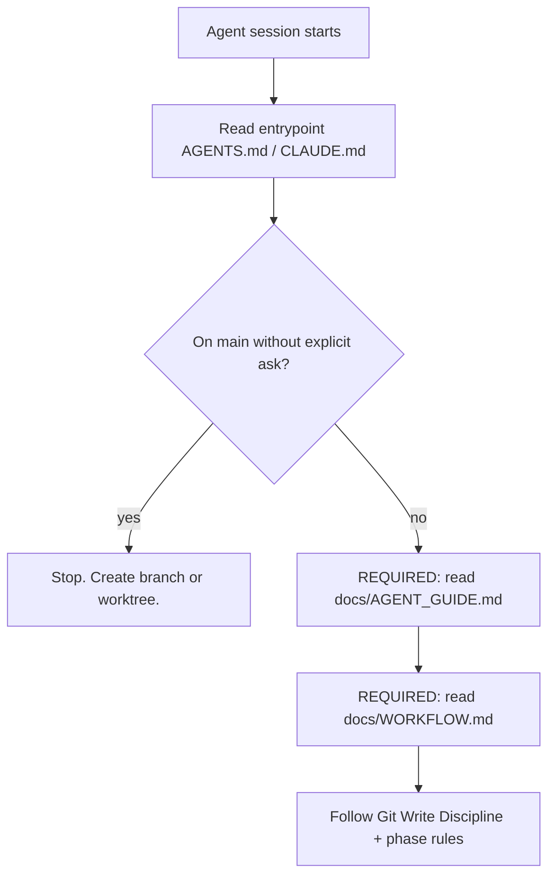

# Change: Add git write hard gate to entrypoints (issue #5)

## Intent

Closes https://github.com/PermissionLabs/forgekit/issues/5.

A downstream ForgeKit-based repo (`PermissionLabs/doingly`) had all expected
harness files installed, yet an agent still committed and pushed directly to
`main` because the rule lived only in linked workflow docs, not in the
entrypoint itself.

Promote the highest-risk git rules to a hard gate at the very top of the Codex
and Claude entrypoints so the rule is read before any other context.

## Scope

- In scope: entrypoint hard gate in `templates/AGENTS.md`, `templates/CLAUDE.md`
  and the matching root files; merge evidence fields in `CHANGE_TEMPLATE.md`;
  branch protection recommendation in `BOOTSTRAP.md`.
- Out of scope: bootstrap sync verification (issue #3), review tool
  specification (issue #4), automated pre-push hook installation.

## Current State

Before this change:

- `templates/CLAUDE.md` and `templates/AGENTS.md` only routed agents to
  `docs/AGENT_GUIDE.md`, `docs/PROJECT_CONTEXT.md`, and `docs/WORKFLOW.md`.
- The "do not commit to `main`" rule existed in `docs/WORKFLOW.md` under
  *Worktree Discipline*, but only an agent that read that file would see it.
- `templates/docs/changes/CHANGE_TEMPLATE.md` had a "Human QA" block with an
  "Accepted by human" line, but no required PR URL, merge SHA, or
  post-merge sync evidence.
- `docs/BOOTSTRAP.md` did not mention branch protection or pre-push hooks.

## Plan

- [x] Plan
- [x] Implement
- [ ] Review
- [ ] Human QA
- [ ] Merge
- [ ] Post-merge
- [ ] Compound capture

## Tracks

| Track | Status | Changed paths | Verification | Risks |
| --- | --- | --- | --- | --- |
| Docs | In progress | entrypoints, CHANGE_TEMPLATE, BOOTSTRAP | manual diff review | downstream repos with stale entrypoints will fail issue #3 sync check once that lands |
| Server | Skipped | — | — | no runtime code |
| Deploy/DevOps | Skipped | — | — | no deploy config |
| Frontend | Skipped | — | — | no UI |
| App | Skipped | — | — | no app |
| Shared contracts | Skipped | — | — | docs-only |

## Architecture and Flow

## Implementation Notes

- **Entrypoint design (revised after review):** entrypoints are kept thin and
  act as a strong-language router. They contain only one inline rule — the
  single highest-risk rule (no direct commit/push on `main`) — and use
  **REQUIRED** language to force the agent to read `docs/AGENT_GUIDE.md`. All
  other git, review, and merge rules live in `docs/WORKFLOW.md`.
- `docs/AGENT_GUIDE.md` (root and template) opens with a **REQUIRED** line
  that the agent must read `docs/WORKFLOW.md` before any code change, doc
  change, or git write op. This makes the routing chain mandatory:
  `entrypoint -> AGENT_GUIDE -> WORKFLOW`.
- `docs/WORKFLOW.md` (root and template) absorbs the rules that previously
  lived inline in the entrypoint. The `Worktree Discipline` section was
  renamed `Git Write Discipline` and now covers branch check commands,
  direct-main ban, destructive-op ban, and branch protection setup. The
  `Human Review Gate` section gained a line forbidding the agent from marking
  `merge` / `post_merge` complete without PR URL + human acceptance + merged
  target-branch state.
- Mirrored entrypoint and guide changes to the forgekit root files so
  forgekit agents are bound by the same routing when they work on forgekit
  itself.
- Added a `Branch & Merge Evidence` section (was `Merge Evidence`) to
  `CHANGE_TEMPLATE.md`, split into "known at implement time" and "required
  before merge/post_merge" fields.
- Added a `Repo-level enforcement (recommended)` section to `BOOTSTRAP.md`
  acknowledging the entrypoint gate is a soft enforcement and pairing it
  with GitHub branch protection + local pre-push hook as the durable fix.

### Interaction with sibling issues

- **#3 (bootstrap sync gap):** this change touches `templates/CLAUDE.md`,
  `templates/AGENTS.md`, and `templates/docs/changes/CHANGE_TEMPLATE.md`. Once
  #3 lands a byte-identical sync check, existing downstream repos will appear
  out of sync until they re-bootstrap or copy the updated entrypoints. This
  ordering is intentional — #5 must land before #3 sets the baseline.
- **#4 (review tools):** entrypoints stay minimal. The review tool spec
  belongs in `WORKFLOW.md` and `templates/skills/`, not in the entrypoint.

## Documentation Updates

- Updated docs: `CLAUDE.md`, `AGENTS.md`, `templates/CLAUDE.md`,
  `templates/AGENTS.md`, `docs/AGENT_GUIDE.md`, `templates/docs/AGENT_GUIDE.md`,
  `docs/WORKFLOW.md`, `templates/docs/WORKFLOW.md`,
  `templates/docs/changes/CHANGE_TEMPLATE.md`, `docs/BOOTSTRAP.md`.
- `WORKFLOW.md` is now the single source of truth for git/review/merge rules.
  Entrypoints route via `AGENT_GUIDE.md` to `WORKFLOW.md` and only inline the
  highest-risk rule (no direct-main commit/push).

## Verification

- Commands run: `git diff --stat` to confirm only the intended files changed.
- Manual checks: re-read each modified file end to end.
- Not run: no automated test suite covers prose changes.

## Review Cycles

| Cycle | Type | Findings | Resolution |
| --- | --- | --- | --- |
| 1 | Code + security | TBD | TBD |

## Human QA

- Handoff URL/build/instructions: PR will be opened; reviewer reads the diff.
- Human-reported issues: TBD
- Fixes applied: TBD
- Accepted by human: TBD

## Branch & Merge Evidence

Known at implement time:

- Working branch: `feature/issue-5-git-write-hard-gate`
- Target branch: `main`
- PR URL: https://github.com/PermissionLabs/forgekit/pull/6

Required before marking `merge` / `post_merge` complete:

- Human review accepted by: TBD
- Human QA accepted by: TBD
- Merge SHA (or merged PR link): TBD
- Post-merge sync command + result: TBD
- Residual risks acknowledged: TBD

## Residuals

| Source | Finding | Disposition | Link/reason |
| --- | --- | --- | --- |
| Plan | Downstream repos will drift on next sync check (issue #3 dependency) | accepted_with_reason | Intentional ordering — #5 first, then #3 baseline |
| Plan | Hard gate is soft enforcement; can still be bypassed by misbehaving agent | filed_followup | BOOTSTRAP.md now recommends branch protection + pre-push hook |

## Compound Capture

- Reusable learning captured: yes — entrypoint hard gates as a pattern.
- Solution doc: this CHANGE record + the new "Repo-level enforcement" section
  in `BOOTSTRAP.md` together capture the lesson.
- Skipped because: n/a

## Follow-ups

- Issue #3 (bootstrap sync gap) should land next; it will catch downstream
  entrypoints that haven't picked up this gate.
- Issue #4 (review tools) — entrypoint must stay minimal; review tools go in
  `WORKFLOW.md`/`templates/skills/`.
- Consider shipping a sample `pre-push` hook in `templates/githooks/` in a
  later PR.
