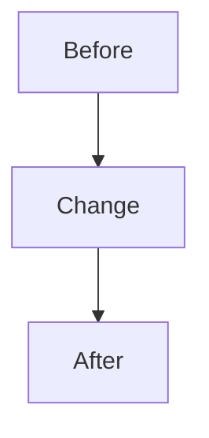

# Change: TBD

## Intent

Describe the user request, the intended outcome, and the human-visible success
criteria.

## Scope

- In scope: TBD
- Out of scope: TBD

## Current State

Summarize the relevant existing behavior, entry points, commands, and documents
that were checked before implementation.

## Plan

- [ ] Plan
- [ ] Implement
- [ ] Review
- [ ] Human QA
- [ ] Merge
- [ ] Post-merge
- [ ] Compound capture

## Tracks

Mark inactive tracks as skipped with a reason.

| Track | Status | Changed paths | Verification | Risks |
| --- | --- | --- | --- | --- |
| Server | Pending | TBD | TBD | TBD |
| Deploy/DevOps | Pending | TBD | TBD | TBD |
| Frontend | Pending | TBD | TBD | TBD |
| App | Pending | TBD | TBD | TBD |
| Shared contracts | Pending | TBD | TBD | TBD |
| Docs | Pending | TBD | TBD | TBD |

## Architecture and Flow

Include data flow, sequence diagrams, Mermaid diagrams, UML, or screenshots when
they help future agents and reviewers understand the change.

## Implementation Notes

Record important implementation decisions, files touched, compatibility notes,
and rejected alternatives.

## Documentation Updates

- Updated docs: TBD
- No doc update needed because: TBD

## Verification

- Commands run: TBD
- Manual checks: TBD
- Not run: TBD

## Review Cycles

Record code review, security review, API contract review, deployment review,
design review, and unresolved concerns.

| Cycle | Type | Findings | Resolution |
| --- | --- | --- | --- |
| 1 | Code + security | TBD | TBD |

## Human QA

Record what the human tested and what they reported.

- Handoff URL/build/instructions: TBD
- Human-reported issues: TBD
- Fixes applied: TBD
- Accepted by human: TBD

## Branch & Merge Evidence

Fill the branch fields during `implement`. Merge is human-owned: `merge` and
`post_merge` may not be marked complete until every gate field below also has a
real value (not TBD).

Known at implement time:

- Working branch: TBD
- Target branch: TBD
- PR URL: TBD

Required before marking `merge` / `post_merge` complete:

- Human review accepted by: TBD
- Human QA accepted by: TBD
- Merge SHA (or merged PR link): TBD
- Post-merge sync command + result: TBD
- Residual risks acknowledged: TBD

## Residuals

Every finding must end as `fixed`, `filed_followup`,
`accepted_with_reason`, or `blocked`.

| Source | Finding | Disposition | Link/reason |
| --- | --- | --- | --- |
| TBD | TBD | TBD | TBD |

## Compound Capture

- Reusable learning captured: TBD
- Solution doc: TBD
- Skipped because: TBD

## Follow-ups

- TBD
